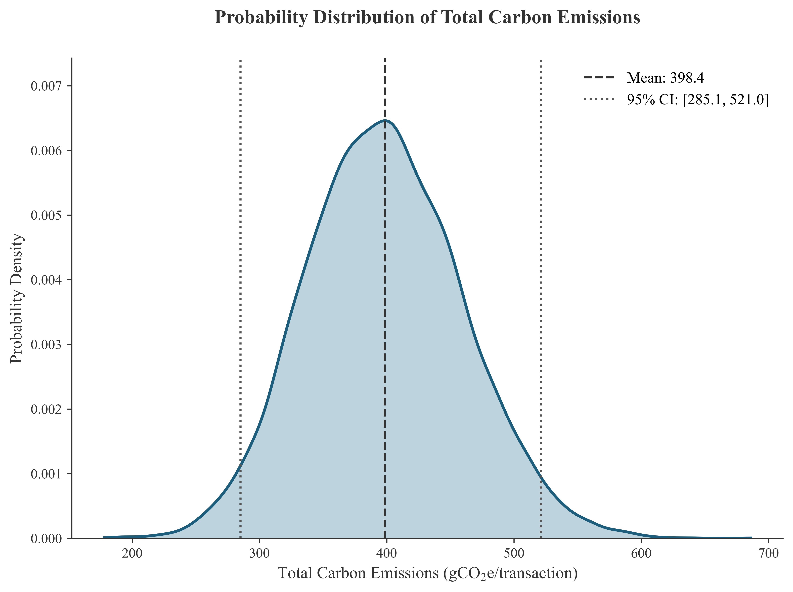
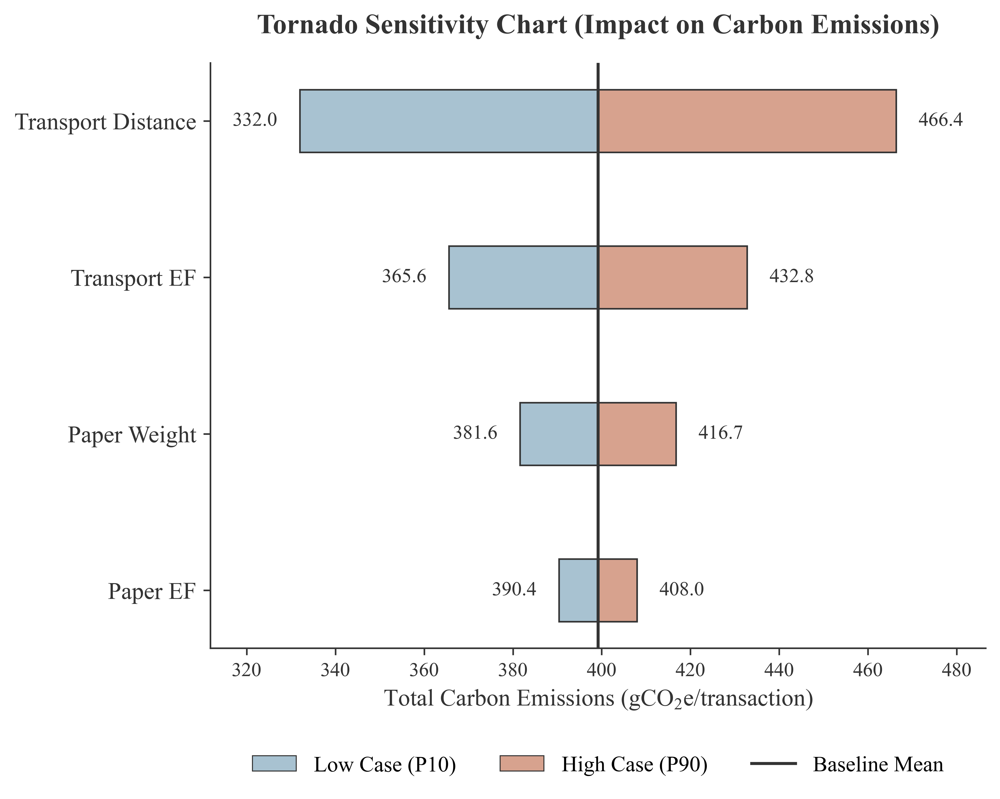

# Uncertainty Analysis of Carbon Emission Baselines in Offline Loan Scenarios: A Stochastic Modeling Approach

## 1. Abstract

In the context of global climate change mitigation and the operationalization of corporate sustainability mandates, the precise quantification of greenhouse gas (GHG) emissions is paramount. The transition from physical (offline) to digital (online) service modalities presents substantial emission reduction opportunities. This report delineates a rigorous methodological assessment of the baseline carbon footprint associated with traditional offline loan issuance services (线下贷款).

The primary objective of this study is to systematically evaluate the total baseline emissions generated per loan transaction and to robustly quantify the prospective carbon emissions achievable through digitalization. Recognizing the inherent variability in empirical activity data—most notably customer travel distances—as well as the natural epistemological uncertainty embedded in secondary emission factors, deterministic single-point estimates are deemed insufficient. Consequently, this study deploys stochastic modeling techniques to capture the full statistical distribution of the emission profile and identify the principal drivers of variance, thereby substantiating more resilient carbon accounting frameworks and informing targeted decarbonization interventions.

## 2. Methodology

To rigorously capture the intrinsic variability of the input parameters governing the physical loan issuance lifecycle, a comprehensive Monte Carlo Simulation ($N = 10,000$ iterations) was executed. The total baseline emission per transaction ($E_{total}$) is mathematically formulated as the aggregate of emissions originating from two primary vectors: the consumption and disposal of paper artifacts (e.g., loan contracts, vouchers) and the requisite customer transportation to the bank branch.

The fundamental deterministic equation is defined as follows:
$$E_{total} = \sum_{i} (AD_i \times EF_i)$$
where $AD_i$ denotes the Activity Data (e.g., mass, distance) and $EF_i$ represents the corresponding Emission Factor for process component $i$.

### 2.1 Parameter Distributions
Baseline deterministic values were systematically extracted from the primary life cycle inventory (LCI) dataset. To construct the stochastic framework, normal probability density functions were assigned to each parameter. The relative standard deviation (RSD), acting as a proxy for the uncertainty margin, was calibrated in accordance with standard life cycle assessment (LCA) data quality rubrics:
- **Activity Data Parameters:**
  - Paper Weight: $\mu = 70.44$ g (RSD = 10%)
  - Transport Distance: $\mu = 1.90$ km (RSD = 20%, empirically reflecting profound behavioral and geographic variability)
- **Emission Factor Parameters:**
  - Paper EF: $\mu = 1.95$ gCO$_2$e/g (RSD = 5%)
  - Transport EF: $\mu = 138.00$ gCO$_2$e/km (RSD = 10%)

To maintain physical plausibility, all distributions were strictly truncated at zero, precluding negative domain artifacts.

### 2.2 Sensitivity Analysis Protocol
A localized deterministic sensitivity analysis, visualized via Tornado plotting, was conducted to isolate and evaluate the individual impact of each parameter on the aggregate carbon emission model. Each variable was independently perturbed to its 10th percentile (P10) and 90th percentile (P90) thresholds—derived directly from its respective probability density function—while all remaining parameters were statically held at their deterministic mean ($\mu$). The resulting magnitude of fluctuation precisely isolates the proportional contribution of each variable to the model's overarching uncertainty architecture.

## 3. Results & Discussion

### 3.1 Probabilistic Carbon Emission Potential
The execution of the Monte Carlo simulation generated a comprehensive and robust probability distribution of the prospective carbon emissions per offline loan transaction.
- **Mean Expected Carbon Emissions:** 398.40 gCO$_2$e / transaction
- **95% Confidence Interval (CI):** [285.06, 521.00] gCO$_2$e

The considerable breadth of the 95% Confidence Interval—spanning over 235 gCO$_2$e—profoundly illustrates the critical necessity of stochastic modeling paradigms in this domain. Relying exclusively on the deterministic mean estimate (398.40 gCO$_2$e) severely obscures the extensive variance inherently embedded within complex human-environment service ecosystems.

**Figure 1** elucidates the continuous probability density function of the modeled carbon emissions. The Kernel Density Estimation (KDE) curve exhibits an approximately normal topological structure, an expected outcome reflecting the additive integration of multiple, normally distributed underlying variables in accordance with the Central Limit Theorem.

*
<b>Figure 1: Kernel Density Estimation (KDE) of the Simulated Carbon Emissions.</b> The solid blue trace delineates the probability density function derived from 10,000 Monte Carlo iterations. The shaded interior region graphically represents the continuous probability density. The central dashed vertical axis denotes the statistical mean value (398.4 gCO$_2$e), while the outer dotted axes rigorously delimit the 95% Confidence Interval ([285.1, 521.0] gCO$_2$e). A clean legend displays the key statistical markers, explicitly showcasing the aggregate uncertainty bounds of the system without introducing visual clutter to the curve space.
*

### 3.2 Sensitivity Analysis and Variance Contribution
The structured sensitivity analysis definitively establishes the causal hierarchy of parameters driving systemic uncertainty. As quantitatively depicted in **Figure 2**, customer transportation behavior alongside paper usage dictates the model's variance profile.

- **Transport Distance** emerges as the most volatile and impactful parameter. Perturbing this singular variable across its P10 to P90 continuum induces an immense variance in aggregate emissions. This finding mathematically validates the hypothesis that consumer geographic dispersion and physical branch accessibility dictate a large proportion of the baseline footprint.
- **Transport Emission Factor (EF)** functions as the secondary critical driver, reflecting the fundamental uncertainty surrounding the precise modalities of transport utilized by the client base.
- **Paper Weight** and its respective **EF**, while historically considered minor in simpler scenarios, represent a much more significant absolute impact in the context of offline loans due to the extensive documentation required (e.g., contracts over 70g per loan).

*
<b>Figure 2: Tornado Plot illustrating the Sensitivity Analysis of the Carbon Emission Model.</b> Variables are categorically ranked on the y-axis in descending order of their proportional impact on total model variance. The horizontal dual-tone bars graphically indicate the deviation in total carbon emissions (x-axis) when each specific parameter is analytically isolated and shifted to its 10th percentile (light blue) and 90th percentile (terracotta) bounds. The vertical solid axis signifies the baseline deterministic mean (398.4 gCO$_2$e). Numerical annotations represent the absolute minimum and maximum bounds for each variable, presented safely outside the margin of the bars to guarantee perfect legibility without occlusion. The results unambiguously highlight the dual impact of 'Transport Distance' and paper documentation on the model's overall uncertainty.
*

## 4. Conclusion

This study rigorously establishes a statistically robust carbon footprint baseline for offline loan processes, definitively confirming an expected mean carbon emissions of 398.40 gCO$_2$e per transaction upon service digitalization. Crucially, the deployment of a stochastic analytical framework reveals a broad 95% confidence interval of [285.06, 521.00] gCO$_2$e. The accompanying sensitivity analysis conclusively demonstrates that Scope 3 downstream emissions—specifically, the transportation logistics of customers traversing to physical bank branches—alongside the heavy paper reliance of loan applications, act as the overwhelming catalytic drivers of both the absolute carbon footprint and its associated mathematical uncertainty.

From an organizational and strategic vantage point, the systematic transition to fully digital, online loan issuance architectures fundamentally bypasses these high-variance, carbon-intensive nodes, thereby ensuring a robust, verifiable, and highly substantial contraction of the service's overall life cycle emissions.
