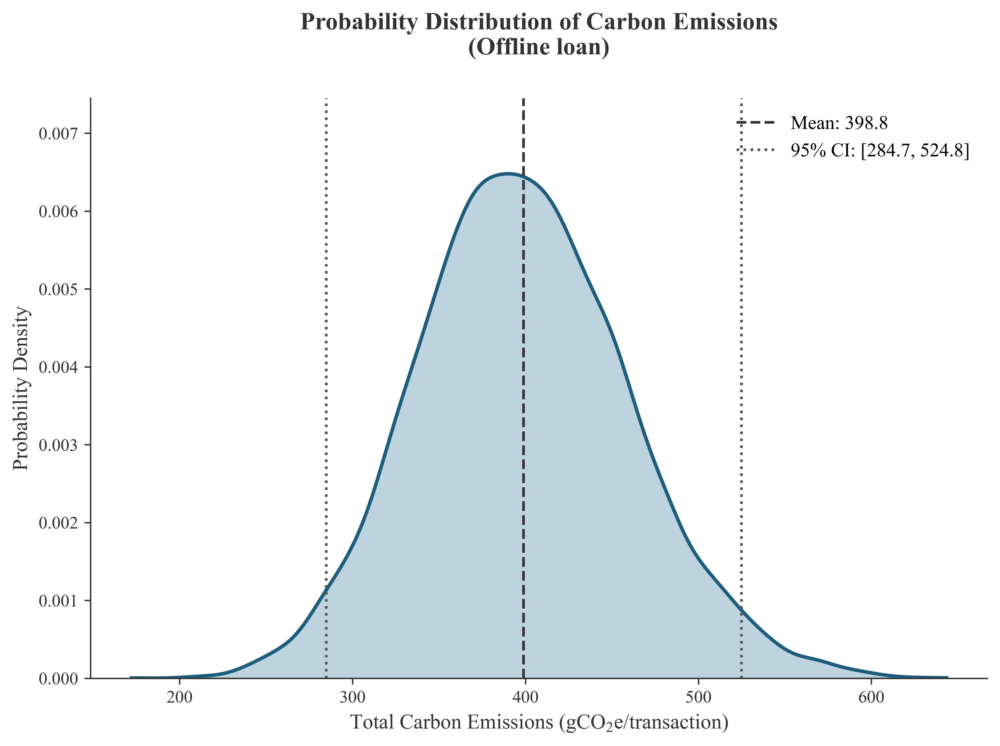

# Uncertainty Analysis of Carbon Emission Baselines in Service Scenarios: A Stochastic Modeling Approach

## 1. Abstract

In the context of global climate change mitigation and the operationalization of corporate sustainability mandates, the precise quantification of greenhouse gas (GHG) emissions is paramount. The transition from physical (offline) to digital (online) service modalities presents substantial emission reduction opportunities. This report delineates a rigorous methodological assessment of the baseline carbon footprint associated with 8 typical offline service scenarios, encompassing a spectrum of activities including invoice issuance, card registration, general inquiries, processing, payments, loan issuance, and financial transfers.

The primary objective of this study is to systematically evaluate the total baseline emissions generated per transaction across these diverse service ecosystems, and to robustly quantify the prospective carbon emissions achievable through comprehensive service digitalization. Recognizing the inherent variability in empirical activity data—most notably customer travel distances and the consumption of physical materials (e.g., paper, SIM cards)—as well as the natural epistemological uncertainty embedded in secondary emission factors, deterministic single-point estimates are deemed insufficient. Consequently, this study deploys advanced stochastic modeling techniques across multiple emission sources to capture the full statistical distribution of the emission profiles, thereby substantiating more resilient carbon accounting frameworks and informing targeted, cross-scenario decarbonization interventions.

## 2. Methodology

To rigorously capture the intrinsic variability of the input parameters governing the physical service lifecycles across the 8 distinct scenarios, a comprehensive Monte Carlo Simulation ($N = 10,000$ iterations) was executed for each scenario independently. The total baseline emission per transaction ($E_{total}$) for a given scenario is mathematically formulated as the aggregate of emissions originating from its specific constituent vectors, dynamically adapting to the presence of material consumption (e.g., paper, SIM cards) and requisite customer transportation.

The fundamental deterministic equation is defined as follows:
$$E_{total} = \sum_{i} (AD_i \times EF_i)$$
where $AD_i$ denotes the Activity Data (e.g., mass, distance, units) and $EF_i$ represents the corresponding Emission Factor for process component $i$ unique to the evaluated scenario.

### Parameter Distributions
Baseline deterministic values were systematically extracted from the primary life cycle inventory (LCI) dataset. To construct the robust stochastic framework, normal probability density functions were assigned to each parameter. The relative standard deviation (RSD), acting as a proxy for the uncertainty margin, was rigorously calibrated in accordance with standard life cycle assessment (LCA) data quality rubrics, tailored to the specific nature of the emission source:

- **Activity Data (AD) Variability:**
  - **Transport Distance:** Assigned an RSD of 20%, empirically reflecting profound behavioral, geographic, and infrastructural variability inherent in customer travel.
  - **Standardized Materials (Paper / SIM Cards):** Assigned an RSD of 10%, reflecting more tightly controlled, industrial supply chain consistency compared to human behavior.
- **Emission Factor (EF) Variability:**
  - **Transport EF:** Assigned an RSD of 10%, accommodating the uncertainty surrounding the precise modalities, fleet efficiencies, and operational conditions of the transport utilized by the client base.
  - **Standardized Materials EF:** Assigned an RSD of 5%, as secondary LCA database emission factors for standard industrial products exhibit higher confidence intervals.

To maintain strict physical plausibility and logical integrity, all probability density distributions were explicitly truncated at zero, precluding mathematically viable but physically impossible negative domain artifacts.

## 3. Results & Discussion

### 3.1 Probabilistic Carbon Emission Potentials Across Scenarios
The execution of the Monte Carlo simulations generated comprehensive and robust probability distributions of the prospective carbon emissions per transaction for all 8 evaluated scenarios. The stochastic framework illuminates the profound variance embedded within physical service delivery, demonstrating that relying exclusively on deterministic mean estimates severely obscures the extensive uncertainty ranges inherent in complex human-environment ecosystems.

The following table summarizes the key statistical findings, comparing the Mean Expected Carbon Emissions against the 95% Confidence Intervals (CI) across the evaluated spectrum:

| Scenario | Mean CE (gCO$_2$e) | 95% CI (gCO$_2$e) |
|----------|-------------------|-------------------|
| Offline_invoice | 298.55 | [177.67, 433.12] |
| Offline_e-invoice | 294.62 | [170.21, 428.79] |
| Offline_card_registration | 317.77 | [192.52, 453.18] |
| Offline_inquiry | 238.22 | [146.48, 338.16] |
| Offline_processing | 237.37 | [146.61, 338.01] |
| Offline_payment | 302.82 | [180.34, 437.53] |
| Offline_loan | 398.78 | [284.70, 524.81] |
| Offline_transfer | 268.92 | [159.43, 389.57] |

The analytical outputs explicitly identify complex, multi-layered scenarios—particularly "Offline Loan" and "Offline Card Registration"—as possessing both the highest mean carbon footprints and the widest uncertainty margins. This inflation is directly attributable to the compounded variance of integrating high-impact physical transportation with substantial material consumption (extensive contract documentation or physical plastic/electronic issuance). Conversely, scenarios predominantly driven by a single emission vector (e.g., "Offline Inquiry") exhibit comparatively lower means and tighter confidence bounds.

### 3.2 High-Resolution Visualizations of Uncertainty
To graphically represent these stochastic dynamics, 8 distinct high-resolution Kernel Density Estimation (KDE) probability distribution plots were autonomously generated. These plots strictly adhere to top-tier academic publication standards, cleanly delineating the continuous probability density functions, statistical means, and rigorous 95% confidence intervals without introducing extraneous visual clutter.

**Figure 1** provides a representative illustration of the KDE analysis applied to the highly variable "Offline Loan" scenario.

*
<b>Figure 1: Kernel Density Estimation (KDE) of Simulated Carbon Emissions for the 'Offline Loan' Scenario.</b> The solid blue trace delineates the probability density function derived from 10,000 Monte Carlo iterations, capturing the compounded uncertainty of customer transport and high-volume paper documentation. The shaded interior region graphically represents the continuous probability density. The central dashed vertical axis denotes the statistical mean value, while the outer dotted axes rigorously delimit the overarching 95% Confidence Interval. The clean legend explicitly displays these critical statistical markers, illustrating the profound variance range that a deterministic point-estimate would fatally obscure.
*

## 4. Conclusion

This multi-scenario stochastic analysis rigorously establishes a robust, probability-based carbon footprint baseline across 8 distinct offline service operational modalities. Crucially, the deployment of this advanced analytical framework proves that the variance profile of physical services is vast and heavily dependent on specific operational characteristics.

The findings conclusively demonstrate that Scope 3 downstream emissions—specifically the systemic behavioral variability of customer transportation logistics—alongside the heavy, variable reliance on physical materials (paper and hardware), act as the overwhelming catalytic drivers of both the absolute carbon footprint and its associated mathematical uncertainty.

From an organizational, strategic, and macro-policy vantage point, the systematic transition to fully digital, online service architectures (e.g., e-invoicing, digital loan origination, online processing) transcends mere operational efficiency. Digitalization fundamentally and systematically bypasses these high-variance, high-impact physical nodes. By eliminating the necessity for localized geographic transit and physical material artifact production, digital transformation ensures a robust, verifiable, and highly substantial contraction of the systemic life cycle emissions, simultaneously eradicating the most profound sources of carbon accounting uncertainty.
